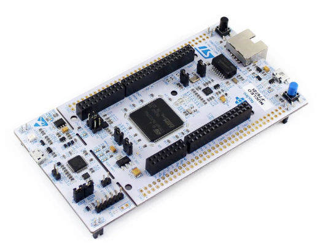

# stm32-vector-xcp-slave

A try to adapt Vector XCP driver sample code (https://github.com/vectorgrp/XCPlite) to work on STM32F767ZIT

## Build
cmake -S . -B build
cmake --build build

Then use STM32CubeProgrammer to push stm32-vector-xcp-slave.elf to STM device 

## Debugging in VSCode
- printf are redirected to USART3 (main.c)
- Use Serial Monitor VSCode Extension (baud rate 9600) to display logs (much better than minicom!)

## Disclaimer for this project
- Build on Linux only (no Widows Support)
- NUCLEO-F767ZI-144 only (https://www.st.com/en/evaluation-tools/nucleo-f767zi.html)
- STM32CubeMX project generator in cmake mode (https://www.st.com/en/development-tools/stm32-software-development-tools.html)
- STM32 IP address is hard coded (in LWIP config) as 192.168.95.2 (see tests/readme.txt to enable network card access)

