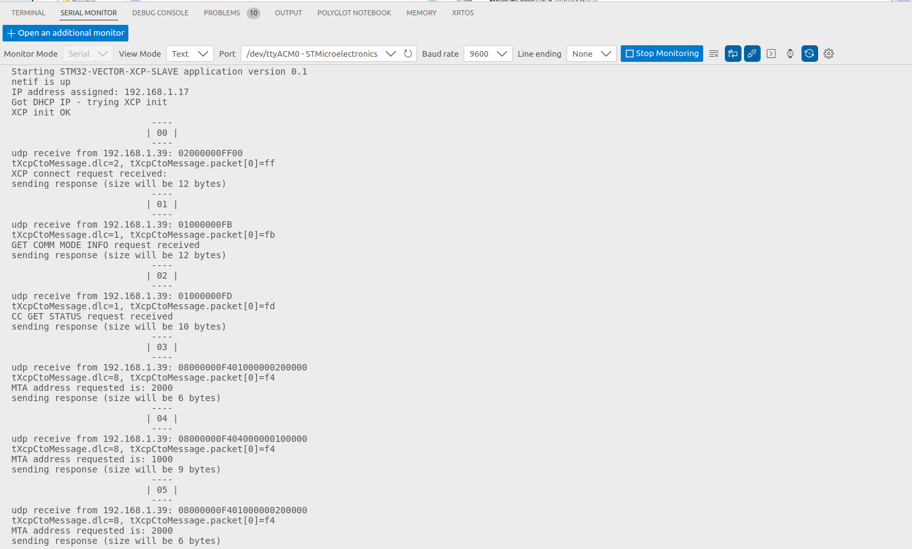

# stm32-vector-xcp-slave

Inspired from Vector XCP driver sample code (https://github.com/vectorgrp/XCPlite) to verify Vector CANape getting measurememts from STM32F767ZIT

CANape device will be set as XCP on ethernet and measures settings will come from ASAP2/nucleo_xcp_slave.a2l file.

We implemented 2 mesures: the blue button pressed state and the proc temperature:

## Build

cmake -S . -B build
cmake --build build

Then use STM32CubeProgrammer to push stm32-vector-xcp-slave.elf to STM device 

## Debugging in VSCode
- printf are redirected to USART3 (main.c)
- Use Serial Monitor VSCode Extension (baud rate 9600) to display logs (much better than minicom!)

## Disclaimer
- Build on Linux only (no Widows Support)
- NUCLEO-F767ZI-144 only (https://www.st.com/en/evaluation-tools/nucleo-f767zi.html)
- STM32CubeMX project generator in cmake mode (https://www.st.com/en/development-tools/stm32-software-development-tools.html)
- STM32 IP address is obtained using LWIP DHCP, therefore Vector CANape need to be updated when address changes

